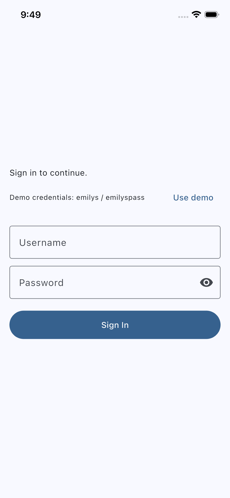
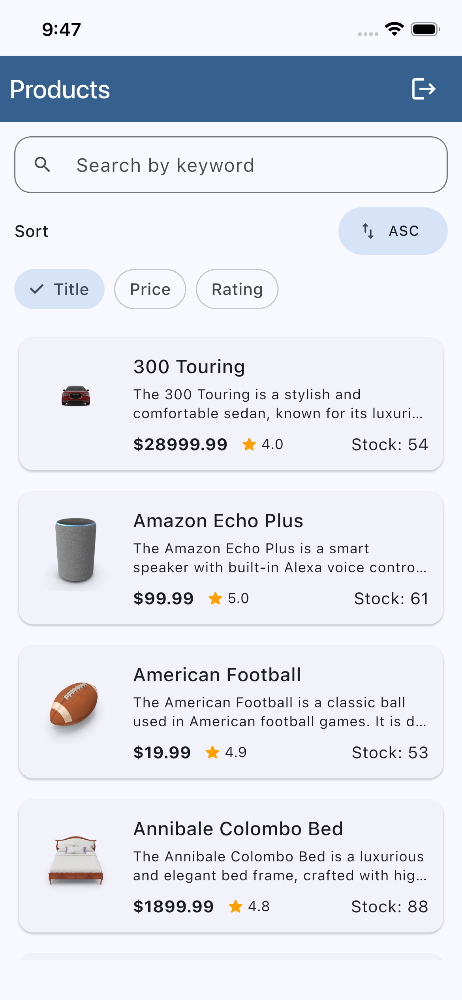
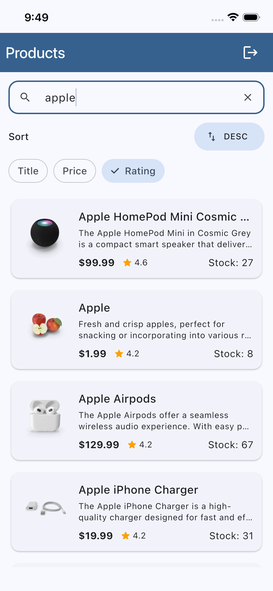

# Flutter Starter Kit

Flutter starter template designed for rapid feature delivery with
clear architecture and production-style conventions.

## Overview

This project is a clean-architecture Flutter starter kit with two sample
features:

- `auth`: login flow with persisted secure session
- `product`: list flow with keyword search, sort, order toggle, pull-to-refresh,
  and pagination

It is intentionally structured to help you start coding quickly while
demonstrating scalable engineering practices.

## Screenshots

Screenshots are loaded from `docs/screenshots/`:

- `login.png`
- `products.png`
- `products_search_sort.png`

Current files are placeholders; replace them with real app captures.

| Login | Products |
|---|---|
|  |  |

| Search + Sort |
|---|
|  |

## Architecture

### Layered design per feature

- `data`: DTOs, datasources, repository implementations, mappers
- `domain`: models, repository contracts, use cases
- `presentation`: UI, BLoC, events, states

### Core modules

- `core/config`: environment/flavor setup (`APP_FLAVOR`, `API_BASE_URL`)
- `core/data/remote`: Dio client, interceptors, safe API call wrapper
- `core/di`: dependency registration with `get_it`
- `core/presentation/router`: `go_router` routes and auth guard
- `core/domain/models`: typed `ApiResult` and `AppError`

## Project Structure

```text
.
├── lib
│   ├── app.dart
│   ├── main.dart
│   ├── core
│   │   ├── config
│   │   ├── data
│   │   │   └── remote
│   │   ├── di
│   │   ├── domain
│   │   │   └── models
│   │   └── presentation
│   │       ├── constants
│   │       ├── router
│   │       ├── theme
│   │       └── widgets
│   └── features
│       ├── auth
│       │   ├── data
│       │   ├── domain
│       │   └── presentation
│       └── product
│           ├── data
│           ├── domain
│           └── presentation
├── test
│   └── features
│       ├── auth
│       └── product
└── docs
    └── screenshots
```

## Tech Stack / Libraries

- Routing: `go_router`
- State management: `flutter_bloc`
- Networking: `dio`
- Dependency injection: `get_it`
- Secure storage: `flutter_secure_storage`
- Model generation: `freezed`, `json_serializable`
- Skeleton loading: `shimmer`
- Testing: `flutter_test`

## Implemented Capabilities

### Auth

- Login request (`POST /auth/login`)
- Form validation
- Secure session persistence
- Guarded route redirect (unauthenticated -> login)

### Product

- Product list request (`GET /products`)
- Keyword search with debounce
- Sort field chips (`Title`, `Price`, `Rating`)
- Order toggle (`ASC` / `DESC`)
- Pull-to-refresh and load-more pagination
- Loading, success, and failure states

## Error Handling

- Unified result model via `ApiResult<Success|Failure>`
- Typed error mapping (`NetworkError`, `ValidationError`, `UnauthorizedError`,
  `ServerError`, `UnknownError`)
- Centralized safe API wrapper (`safe_api_call.dart`)

## Environment Configuration

Set flavor via `dart-define`:

```bash
flutter run --dart-define=APP_FLAVOR=dev
flutter run --dart-define=APP_FLAVOR=staging
flutter run --dart-define=APP_FLAVOR=prod
```

Override base URL:

```bash
flutter run --dart-define=API_BASE_URL=https://api.example.com
```

## Setup

### Requirements

- Flutter SDK (stable)
- Dart SDK `^3.11.0`

### Install and run

```bash
flutter pub get
flutter run
```

## Quality Checks

```bash
flutter analyze
flutter test
```

## Code Generation

Run when `freezed`/`json_serializable` models or states change:

```bash
dart run build_runner build --delete-conflicting-outputs
```

## Notes

This template is optimized to start new app features quickly:

- clear feature boundaries
- testable architecture
- practical patterns for API + state + error handling
- enough structure without over-engineering
